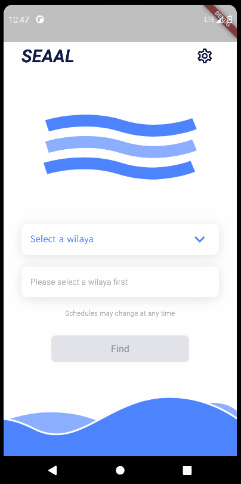

# Water Schedule App

TLDR: an app to get information about the local water availablity schedule.

This project stemed from the unfortunate water crisis that has befallen on my country due to the lack of rainfall. Since water has become a scarce resource, and is therefore not available everyday, I've written this (concept) app in my spare time as a mean to provide people with information regarding the water availability schedules. The idea was to create an app that is simple and agreeable to use whilst being amply informative. The app started as a **React-Native** project but was switched to [**Flutter**](https://docs.flutter.dev/) early in the process in favor of its enhanced performance. The app fetches data from the api that is present in the administation server, which is another project that allows to manage and set water availability schedules data and which can be found in this [github repository](https://github.com/medchek/water-schedule-admin).

## App in Action

  

## Features

- Easy to use.
- Pleasant UX.
- Features a dark mode.
- Multiligual.
- Supports both Android and iOS.
- Data caching to prevent unnecessary api calls.

## Development

It is recommended to use vscode and install the Dart and Flutter extensions for hot-reloading and a wide range of toolings. It is also recommended to have an android/ios emulator installed on the locale machine since this app is not designed to work in a web environment (although it can).

A thorough guide to get you started can be found [here](https://docs.flutter.dev/get-started/install).

## Disclaimer

The SEAAL branding is just for show purposes, this app is not endorsed by seaal (which is the government companany responsible for water provision and sanitation in Algeria) or related to them.

## License

The app is released under the [GPL-3.0 license](https://www.gnu.org/licenses/gpl-3.0.en.html).
